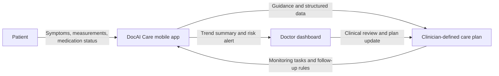
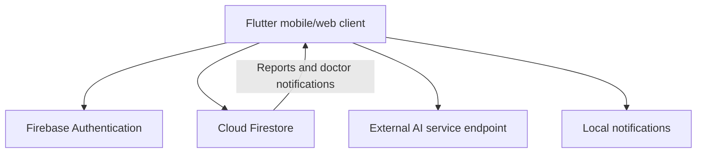

# DocAI Care

> AI-assisted, doctor-supervised continuous care for people living with hypertension and diabetes in Uzbekistan.

DocAI Care is a mobile HealthTech platform that helps clinics stay connected with patients between appointments. It does **not** diagnose diseases, prescribe medication, or replace a licensed clinician. Instead, it helps patients record relevant health information, follow a clinician-defined care plan, receive reminders, and share structured updates with their doctor.

The current MVP focuses on the first two chronic-care pathways:

- Arterial hypertension
- Diabetes mellitus

## The problem

Chronic-disease care often breaks down after a clinic visit. Patients may miss medication, forget to measure blood pressure or glucose, postpone follow-up appointments, or fail to report worsening symptoms. Doctors then receive incomplete information and only learn about deterioration when the patient returns in person.

DocAI Care is designed to close this gap by creating a continuous, clinician-supervised care loop:

1. A patient describes symptoms and records follow-up data.
2. The platform helps direct the patient to the appropriate specialist and clinic.
3. A clinician confirms the diagnosis, treatment plan, and monitoring requirements.
4. The patient receives medication and measurement reminders.
5. The platform analyses longitudinal patient-reported data within a limited clinical scope.
6. A structured report and risk alert are delivered to the responsible clinician when review is needed.

## What makes DocAI Care different

DocAI Care is not positioned as a general-purpose medical chatbot. Its product direction is a **closed-loop chronic-care workflow**:

- **Clinician in control** — the doctor, not the AI, makes the diagnosis and treatment decision.
- **Disease-specific monitoring** — the initial scope is hypertension and diabetes, rather than unrestricted medical advice.
- **Risk-based follow-up** — incoming data is intended to be grouped into low, medium, and high-risk states for clinician review.
- **Patient-to-clinic continuity** — reminders, reports, escalation, and follow-up stay connected to the treating clinician.
- **Local accessibility** — the mobile experience supports Uzbek, Russian, and English.

## MVP capabilities

| Capability | Current status |
| --- | --- |
| Email/password authentication and patient/doctor roles | Implemented |
| Patient and doctor profiles | Implemented with Firebase Authentication and Firestore |
| Patient-to-doctor linking | Implemented |
| Doctor dashboard for linked patients | Implemented |
| AI chat interface and optional doctor report flow | Implemented; AI is accessed through an external service endpoint |
| Doctor-facing patient reports | Implemented |
| Local medication reminder capability | Implemented in the mobile client |
| Weather and device-location support | Implemented |
| Symptom analysis and appointment-booking UX | Prototype flow in the current MVP |
| Clinic map, live availability, and booking integrations | Planned |
| Voice and image analysis | Planned |

> **Important:** The MVP must not be used for emergency care. When a patient may be in immediate danger, they must contact emergency services or seek in-person medical care.

## Product workflow



## Architecture



### Technology stack

- **Client:** Flutter / Dart
- **State management:** flutter_bloc (Cubit)
- **Navigation:** go_router
- **Authentication and data:** Firebase Authentication, Cloud Firestore
- **AI integration:** external HTTP endpoint, isolated from the client codebase
- **Localization:** Slang (`uz`, `ru`, `en`)
- **Notifications:** flutter_local_notifications
- **Location and weather:** geolocator and Open-Meteo

## Clinical safety principles

DocAI Care follows these product principles:

1. AI output is supportive information, not a medical diagnosis or prescription.
2. A licensed clinician remains responsible for clinical decisions.
3. The product must show clear emergency escalation guidance for red-flag symptoms.
4. Clinical pathways are introduced only after medical review and validation.
5. Health data must be processed with consent, purpose limitation, access controls, and auditability.

The current clinical scope is intentionally limited. Expansion to additional diseases, image analysis, or voice analysis will require separate medical validation, privacy assessment, and safety testing.

## Repository scope and intellectual property

This repository is a source-code demonstrator for technical review.

- It contains the mobile application architecture and selected implementation modules.
- It **does not** contain API keys, production credentials, patient data, proprietary datasets, model weights, confidential prompts, or production AI infrastructure.
- The `.env` file is intentionally excluded from version control. Never commit real credentials.
- Public access to this repository does not grant permission to copy, commercialize, train on, or redistribute the code or product materials.

Copyright © 2026 DocAI Care contributors. All rights reserved.

## Getting started

### Prerequisites

- Flutter SDK compatible with Dart `^3.11.0`
- A Firebase project configured for Android, iOS, and/or Web
- An AI service endpoint for the chat feature

### 1. Clone and install dependencies

```bash
git clone <your-repository-url>
cd doc_ai
flutter pub get
```

### 2. Configure environment values

Create a local `.env` file. Do not commit it.

```env
DOC_AI_API_URL=https://your-ai-service.example
DOC_AI_API_KEY=your-local-development-key
```

For production, secrets should be kept on a server-side service rather than embedded in a distributed mobile application.

### 3. Configure Firebase

The project expects Firebase configuration files generated for the target environment:

- `lib/firebase_options.dart`
- `android/app/google-services.json`
- `ios/Runner/GoogleService-Info.plist`

Review `firestore.rules` before every deployment. Production rules must enforce least-privilege access to patient, doctor, report, and notification data.

### 4. Run the application

```bash
flutter run
```

### Quality checks

```bash
flutter analyze
flutter test
```

## Project structure

```text
lib/
├── core/                 # Router, theme, settings, services, shared widgets
├── features/
│   ├── ai_chat/          # Patient AI chat and doctor-report workflow
│   ├── auth/             # Authentication
│   ├── booking/          # Appointment-booking prototype
│   ├── doctor_connect/   # Patient-to-doctor linking
│   ├── doctor_dashboard/ # Linked-patient dashboard
│   ├── doctor_patient_reports/
│   ├── medication/       # Reminder and adherence UI
│   ├── profile/          # Patient and doctor profiles
│   ├── symptom_analysis/ # Symptom-analysis prototype
│   └── weather/          # Location-aware weather card
├── gen/                  # Generated localization code
└── main.dart

functions/                # Firebase Functions experiments/infrastructure
i18n/                     # Uzbek, Russian, and English translation sources
test/                     # Automated tests
```

## Roadmap

### Near term

- Complete the hypertension and diabetes monitoring workflows.
- Add clinician-configured measurement schedules and thresholds.
- Deliver low/medium/high-risk summaries and actionable clinician alerts.
- Add clinic directory, map, specialist matching, and live appointment slots.
- Harden Firestore rules, route authorization, and secret handling.
- Run a supervised pilot with a clinic and collect outcome metrics.

### Next stage

- Integrate connected blood-pressure and glucose devices.
- Add secure voice and image intake after medical validation.
- Expand to additional chronic-care pathways.
- Add clinician analytics, audit trails, and interoperability integrations.

## Team

DocAI Care combines three essential disciplines:

- **Product, AI, and legal/compliance leadership**
- **Mobile engineering**
- **Clinical leadership**

This multidisciplinary structure is deliberate: a responsible HealthTech product needs technical delivery, clinical governance, and legal/privacy oversight from the beginning.

## Demo and supporting materials

- **MVP demo:** _Add a public web-demo or demo landing-page link here_
- **Project video:** _Add an unlisted video link here_
- **Pitch deck:** _Add a presentation link here_

## Contact

For pilot, clinical, investment, or technical-review enquiries, please contact the DocAI Care team through the project submission channel.
